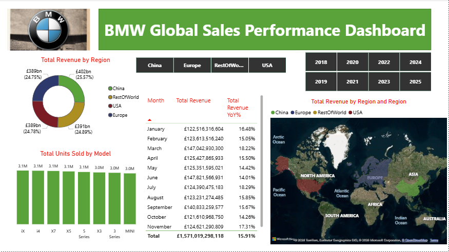

# Data Analytics Portfolio

# Project 1

**Title:** [BMW Global Sales Dashboard 2018-2025.pbix](https://github.com/AtanleyPA/AtanleyPA.github.io/blob/main/BMW%20Global%20Sales%20DashBoard%202018-2025.pbix)

**Tool Used:**  Power BI, Power Query, DAX, Excel

**Techniques:** Data cleaning, data modeling, interactive dashboard design, KPI development, and data visualization.

**Project Description:** This project involves the design of an interactive Power BI dashboard to evaluate BMW’s global sales performance from 2018 to 2025. It converts raw sales data into meaningful insights, allowing users to analyze trends across regions, time periods, and vehicle models.

The dashboard includes key metrics such as total revenue, units sold, and year-over-year growth, supported by visuals like map, bar charts, and trend analyses. Interactive slicers enable users to filter and explore the data for deeper business insights.

The project highlights skills in data transformation using Power Query, data modeling, DAX calculations, and the creation of clear, user-friendly dashboards for business analysis.

*KPI Cards:* Provides a quick snapshot of overall business performance.

*Revenue by Region:* Shows proportion of total revenue contributed by each region. It helps compare market share distribution.

*Units Sold by Model:* Compares sales volume across different BMW models.

*Revenue by Country:* Shows geographical distribution of sales.

*Monthly Revenue & YoY %:* Provides detailed numerical breakdown which allows precise comparison of monthly revenue and growth rate.

**Key Insight:**
*Regional Revenue Distribution:* China generate the highest share of total revenue, USA, Europe and Rest of World contribute moderately, indicating potential growth markets.

*Consistent Revenue Performance:* Monthly revenue remains relatively stable, averaging over £120M+ indicating strong and consistent demand across the period.

*Positive Year-over-Year Growth:* Revenue shows steady YoY growth (~14%–18%) across most months suggesting effective sales strategy and market expansion.

*Top Performing Vehicle Models:* Models such as X5, X7, i4, and iX contribute significantly to total units sold which highlights strong demand for SUV and electric segments.

*Balanced Global Presence:* Sales are well distributed across regions, reducing dependency on a single market and indicates diversified revenue streams and global stability.

*Growth Opportunities:* Regions with lower revenue share present expansion opportunities and also offering potential to increase market penetration through targeted strategies.

**Conclusion:** This dashboard serves as a crucial tool for the BMW company’s management team, providing clear, actionable insights that drive informed decision-making and strategic planning.

**Dashboard Overview**

# Project 2

**Title:** [Girozoline E-Commerce Sales Report Dashboard](https://github.com/AtanleyPA/AtanleyPA.github.io/blob/main/Girozoline%20E-Commerce%20Sales%20Report%20Dashboard.xlsx)

**Tools Used:** Microsoft Excel (Power Query, PivotTables, PivotCharts, Slicers and Timeline Filter)

**Project Description:** An interactive Excel dashboard developed to analyze key sales metrics using a structured dataset. It leverages PivotTables, PivotCharts, slicers, and a timeline to enable dynamic exploration of performance across time, product categories, and regions.
The dashboard provides clear visibility into sales trends, identifies top-performing categories, and highlights regional performance patterns, supporting quick and informed decision-making.

*Product Sales Performance:* Highlights sales performace of each product.

*Product Regional Distribution:* Visual representation of the quantity of product available in each region.

*Profit by Category:* This chart displays the profit each category generates for the organisation within the selected timeframe.

*Sales and Profit by Category:* This chart presents the amount of sales and the corresponding profit from the sales by each category.

*Sales and Profit by Region:* This chart presents the amount of sales and the actual amount of profit from the sales by each region.

*Profit by Product:* Visual representation of the profit from each product.

*Sales Trend:* A graphical representation of the amount of sales over the period of time.

*Profit MoM:* This shows month over month percentage fluctations in the profit margin compared to the previous year.

**Key Insights**

*Sales Trends:* This reveals peak periods, indicating potential seasonality.

*Top-Performing Products:* Highlights which products are driving the most revenue and profit, aiding inventory and marketing decisions.

*Category Performance:* Identifies categories of product which consistently outperform others in revenue generation.

*Regional Analysis:* Highlights areas of strong and weak performance.

*% Profit Differencial:* Shows the fluctuations in monthly profit of the current year versus the corresponding month of previous year, aiding decision making regarding forecast for profit and sales in the calender year.

**Conclusion:** This dashboard enables stakeholders to quickly assess overall business performance, identify growth opportunities, underperforming areas, and make informed decisions based on real-time data exploration.

**Dashboard Overview**

# Project 3

**Title: Car Dealership**

**Project Overview:**
This project contains SQL queries used to analyze a car dealership dataset. The goal is to extract insights such as fuel trends, yearly inventory counts, and sales patterns.

**Dataset:**
The dataset includes the following fields: Name, Year, Selling Price, Kilometers Driven, Fuel Type, Seller Type, Transmission, Owner, Mileage, Engine, Max Power, Torque, Seats

**SQL Skills Used:** 

*Data Retrieval (SELECT):* Queried and extracted specific information from the database.

*Data Aggregation (SUM, COUNT):* Calculated totals, such as sales and quantities, and counted records to analyze data trends.

*Data Filtering (WHERE, BETWEEN, IN, AND):* Applied filters to select relevant data, including filtering by ranges and lists.

*Data Source Specification (FROM):* Specified the tables used as data sources for retrieval

**Technology used:** SQL Server

**SQL Codes:** [Car Dealer SQL Analysis](https://github.com/AtanleyPA/AtanleyPA.github.io/blob/main/Car_Dealer_SQL_Analysis)

**Key Insights:**

*Fuel Trends* Petrol cars were specifically counted for the year 2020. This helps understand fuel preference in a given year.

*Yearly Inventory Growth:* Car counts grouped by year reveal trends in inventory. Useful for identifying growth or decline over time.

*High Inventory Years:* Some years recorded more than 100 cars which may indicate peak year business activity.

*Recent Market Focus (2015–2023):* Filtering data between 2015 and 2023 highlights modern car trends which helps focus on relevant and recent inventory.

*Detailed Dataset Review:* Full dataset extraction for selected years allows: Deeper analysis, Feature comparison, Analyze price trends over time, Compare fuel types by year and identification of most common car brands.

**Conclusion:** This analysis provides a clear view of our dealership’s inventory trends, fuel demand, and recent market activity. The insights can help us stock the right vehicles, focus on high-demand segments, and make smarter sales decisions. Even with simple SQL analysis, we gain practical direction to improve inventory planning and better meet customer needs.

# Project 4

**Title: Football Player SQL Analysis**

**Project Description:** This project uses SQL to analyze football player data, focusing on performance, player attributes, and trends across the dataset.

**Dataset:**

The dataset includes key player information such as: Player Name, Age, College, Team, Position, Experience, Weight, Height, Year

**Objectives:** Analyze player ratings and potential, Explore age and performance trends, Evaluate overall experience level of the team, Evaluate the team net-worth.

**SQL Skills Used:** 

*Data Retrieval (SELECT):* Queried and extracted specific information from the database.

*Data Aggregation (SUM, COUNT):* Calculated totals, such as sales and quantities, and counted records to analyze data trends.

*Data Filtering (WHERE, BETWEEN, IN, AND):* Applied filters to select relevant data, including filtering by ranges and lists.

*Data Source Specification (FROM):* Specified the tables used as data sources for retrieval

*Common Table Expression(CTE):* Used to simplify complex queries by making them more readable and reusable.

**Technology used:** SQL Server

**SQL Codes:** [Football Player SQL Analysis](https://github.com/AtanleyPA/AtanleyPA.github.io/blob/main/Football_Player_SQL_Analysis)

**Key Insights:**

*Top Player Performance:* The highest-rated players represent elite talent. These players typically also have high market value.

*Position-Based Strength:* Certain positions show higher average ratings. This may reflect demand or importance in gameplay.

*College Distribution:* Some college produce significantly more players indicating strong football development systems.

*Market Value Trends:* Player value is closely linked to performance and potential. High-value players based on experience rating often command higher wages.

**Conclusion:**

This analysis helps identify top talent, emerging players, and market trends within the football dataset. The insights can support scouting decisions, squad building, and investment strategies by focusing on high-potential players and high-value positions.

# Project 5

**Title: Work Saftey SQL Analysis**

**Project Overview:**  This project analyzes workplace safety data using SQL to uncover trends, risks, and actionable insights that can help organizations improve employee safety and reduce incidents.

It demonstrates data cleaning, querying, and analytical thinking using SQL, making it ideal for data analyst and business intelligence roles.

**Dataset Description**

The dataset contains workplace safety records, including: Incident ID, Date of incident, Location, Type of injury, Gender, Age Group, Injury Location, details and Department.

**Objective:** Analyze workplace incident data, identify high-risk areas and patterns, and provide insights for decision-making

**SQL Skills Used:** 

*Data Retrieval (SELECT):* Queried and extracted specific information from the database.

*Data Aggregation (SUM, COUNT, MAX):* Calculated totals, such as sales and quantities, and counted records to analyze data trends.

*Data Source Specification (FROM):* Specified the tables used as data sources for retrieval

*Common Table Expression(CTE):* Used to simplify complex queries by making them more readable and reusable.

**Technology used:** SQL Server

**SQL Codes:** [Work Safety SQL Analysis](https://github.com/AtanleyPA/AtanleyPA.github.io/blob/main/Workplace%20Safety%20Data%20Analysis%20(SQL))

**Key Insights:**
*Certain locations consistently report higher incidents*

*Specific departments have increased safety risks*

*Incident frequency varies by time (season/month trends)*

*High severity cases can be isolated for targeted action*

**Business Impact**

This analysis helps the organizations: Improve workplace safety policies, allocate resources to high-risk areas, reduce injury rates, and ensure compliance with safety regulations.

**Conclusion:** The findings highlight the importance of data-driven decision-making in improving workplace safety, enabling organizations to take proactive measures, reduce risks, and enhance overall operational efficiency.

# Project 6

**Title: Sales & Customer Relationship Intelligence System (SQL Analysis)**

**Project Overview:** The Sales & Customer Relationship Intelligence System is a comprehensive SQL-based analytics project explores relationships between salespersons, customers, and orders.

This project focuses on extracting meaningful business insights from relational data by applying joins, filtering, aggregation, and advanced SQL querying techniques.

It demonstrates real-world problem-solving skills relevant to data analytics, business intelligence, and database management roles.

**Dataset:** The project uses three relational tables:

1. *Salesman Table:* Salesman_id, Name, City, Commission

2. *Customer Table:* Customer_ID, Customer_Name, City, Grade, Salesman_ID

3. *Orders Table:* Order Number, Order Date, Purchase Amount, Customer ID, Salesman_id

**Objectives:** Analyze relationships between salespersons and customers, rack and evaluate order transactions, identify high-value customers and sales trends, and generate structured reports for business decision-making

**Key SQL Concepts Applied**

INNER JOIN, LEFT JOIN, FULL OUTER JOIN, CROSS JOIN (Cartesian Product)

Filtering with WHERE conditions

Sorting and grouping

Multi-table relational queries

**Skills Demonstrated:** Advanced SQL query writing, data relationships & joins, business logic implementation, data exploration & reporting, problem-olving with real scenarios

**Technology used:** SQL Server

**SQL Codes:** [Sales & Customer Relationship Intelligence System (SQL Analysis)](https://github.com/AtanleyPA/AtanleyPA.github.io/blob/main/ales%20%26%20Customer%20Relationship%20Intelligence%20System%20(SQL%20Analysis))

**Key Analysis Performed**
 
*Customer & Salesperson Relationship Analysis:* Identified customers and salespersons in the same city, matched customers to their assigned sales representatives.

*Order Insights:* Filtered orders within specific purchase ranges, generated detailed order reports including customer and salesperson data.

*Performance Evaluation:* Identified high-commission salespersons (>12%), evaluated customer grades and purchasing behavior

*Advanced Joins & Reporting:* Built comprehensive reports combining all three tables, ensured inclusion of customers without orders and salespersons without customers.

*Cartesian Product Scenarios:* Explored all possible combinations of salespersons and customers, applied conditions to simulate business scenarios.

**Key Findings**

*Strong relationships exist between customer location and salesperson assignment*

*High commission salespersons can be identified for performance evaluation*

*Some customers may not have placed orders, indicating potential sales gaps*

*Data relationships highlight opportunities for improving customer engagement*

**Conclusion:** This project showcases the practical application of SQL in analyzing relational business data. By combining multiple tables and applying structured queries, it delivers meaningful insights into customer behavior, sales performance, and operational relationships. 

# Project 7

**Title:** [Instagram Usage vs Lifestyle Dashboard](https://github.com/AtanleyPA/AtanleyPA.github.io/blob/main/Assesement%20of%20Instagram%20Usage%20on%20Life%20style.xlsx)

**Tools Used:** Microsoft Excel (Power Query, PivotTables, PivotCharts, Slicers and Timeline Filter)

**Project Overview:** The goal of this project is to explore relationships between social media consumption and well-being indicators across different demographics. The dashboard provides insights into how factors like age, employment status, and location influence Instagram usage and overall lifestyle.

**Dataset Features:** The dataset includes key variables such as:

*Demographics:* Age, Gender, Country, Urban/Rural

*Lifestyle:* Sleep Hours, Exercise, Diet Quality, Smoking, Alcohol

*Social Behavior:* Social Events, Hobbies, Books Read

*Well-being:* Stress Score, Happiness Score

*Digital Usage:* Stories Viewed Per Day

*KPI Cards:* Summarize key metrics such as average Instagram usage, sleep hours, happiness, and stress, providing a quick overview of overall user lifestyle and behavior.

*Relationship Status vs Sleeping Hours:* Shows how sleep duration varies across relationship statuses, highlighting differences in rest patterns among singles, married, and other groups.

*Age Group vs Stories Viewed:* Displays Instagram usage across age groups.

*Diet vs Happiness & Exercise:* Compares diet quality and exercise levels with happiness.

*Stories Viewed vs Social Events:* Illustrates relationship between online activity and real-life social interaction.

*Happiness vs Employment Status & Gender:* Analyzes how happiness varies by employment status and gender, showing differences in well-being across demographic groups.

**Key Insight**

1. *Higher Instagram usage is associated with lower sleep duration*

2. *Users with higher stress levels tend to consume more content*
   
3. *Happiness increases with better lifestyle habits (exercise, diet)*

4. *More real-life social interaction correlates with lower screen time*

5. *Urban users show higher Instagram activity compared to rural users*

6. *Younger age groups are the most active Instagram users*

**Conclusion:** This project demonstrates how data visualization and storytelling can uncover meaningful patterns between digital behavior and real-world lifestyle outcomes.

**Dashboard Overview**

