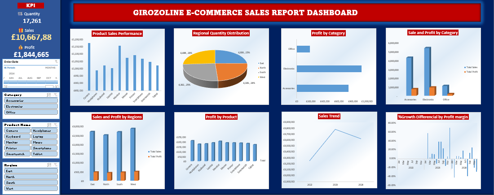

# Data Analytics Portfolio

# Project 1
**Title:** [Girozoline E-Commerce Sales Report Dashboard](https://github.com/AtanleyPA/AtanleyPA.github.io/blob/main/Girozoline%20E-Commerce%20Sales%20Report%20Dashboard.xlsx)

**Tools Used:** Microsoft Excel (Power Query, PivotTables, PivotCharts, Slicers and Timeline Filters)

**Project Description:** An interactive Excel dashboard developed to analyze key sales metrics using a structured dataset. It leverages PivotTables, PivotCharts, slicers, and a timeline to enable dynamic exploration of performance across time, product categories, and regions.
The dashboard provides clear visibility into sales trends, identifies top-performing categories, and highlights regional performance patterns, supporting quick and informed decision-making.

*Product Sales Performance:* Highlight the sales performace of each product.

*Product Quantity Reqional Distribution:* Visual representation of the quantity of product available in each region.

*Profit by Category:* This chart displays the profit each category generates for the organisation within the selected timeframe.

*Sales and Profit by Category:* This chart presents the amount of sales made and the actual amount of profit from the sales by each category.

*Sales and Profit by Region:* This chart presents the amount of sales made and the actual amount of profit from the sales by each region.

*Profit by Product:* Visual representation of the profit from each product.

*Sales trend:* A graphical representation of the amount of sales over the perion of time.

*Profit MoM:* This shows month over month percentage fluctations in the profit margin.

**Key Insights**

*Sales trends:* This reveal peak periods, indicating potential seasonality.

*Top-Performing Products:* Highlighted which products are driving the most revenue and profit, aiding in inventory and marketing decisions.

*Category Performance:* Certain product categories consistently outperform others in revenue generation.

*Regional Analysis:* highlights areas of strong and weak performance.

*% Profit Differencial:* Shows the fluctuations in monthly profit versus the previous year, aiding decision making regarding forcast for profit and sales in the calender year.

**Conclusion:** This dashboard enables stakeholders to quickly assess overall business performance, identify growth opportunities, underperforming areas, and make informed decisions based on real-time data exploration.

**Dashboard Overview**

